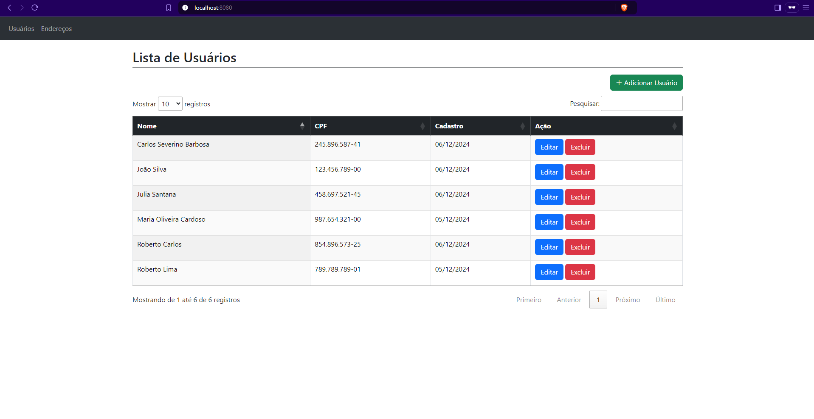
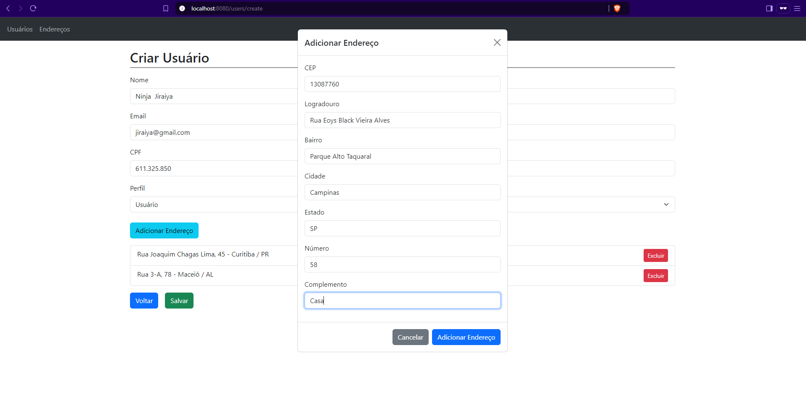
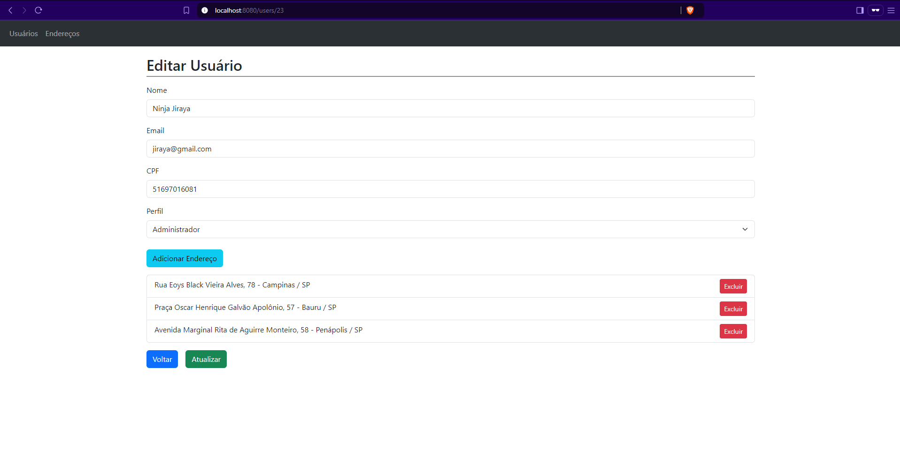
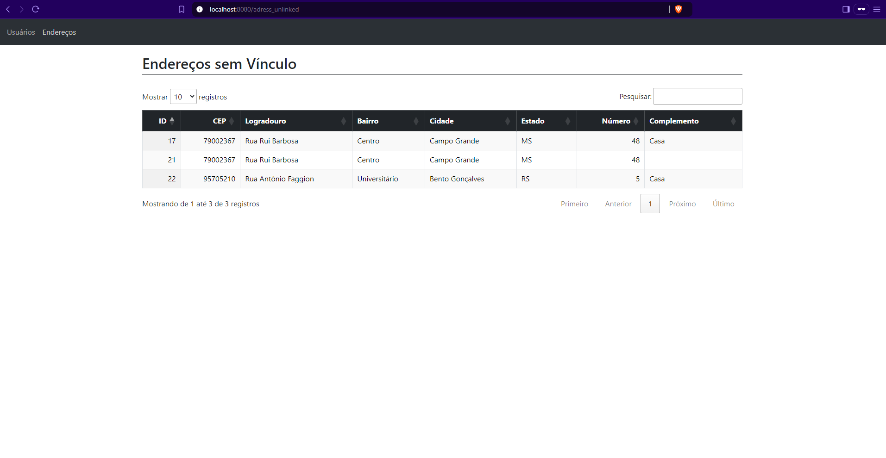

## Frontend with Vue

This project implements a Vue.js frontend that interacts with a Laravel API, providing a CRUD interface for user management. It also includes a feature to view unlinked addresses, enabling efficient data management through the application.

## Resources

- Node v22.12.0;
- Vue 5.0.8
- Bakend: https://github.com/jamison0902/php-laravel-api;

## Home Screen




## Add User Screen




## Edit User Screen



## Adress Unlinked Screen




## Project setup
```
npm install
```

### Compiles and hot-reloads for development
```
npm run serve
```


